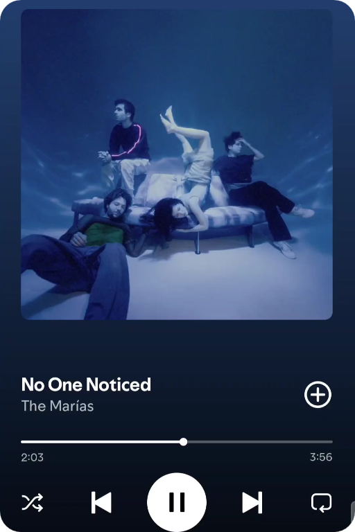

     <strong>Github Stats</strong>

<table align="center">
<tr>
<td width="50%" align="center">
    
</td>
<td width="50%" align="center">
    
</td>
</tr>
</table>

  **Skills**

 

### Technologies & Tools:

 

 ***About me***

I'm a recent SMX (Microcomputer Systems & Networks) grad from Spain, currently on summer break before starting ASIR. I spend my free time deep in offensive security — labs, CTFs, and real-world practice.

* 🎯 Currently prepping for the **OSCP**
* ✅ **eJPT** certified (INE Security)
* 🐧 Linux / networking daily driver
* 🧪 Learning Active Directory & Windows/Linux privilege escalation

<table>
<tr>

<td width="300px">

</td>

<td width="300px">

<pre>
            ⠀⠀⠀⠀⠀⠀⠀⠀⠀⠀⠀⣀⡀⠀⠀⠀⠀⠀⠀⠀⠀⠀⠀⠀⠀⠀
            ⠀⠀⠀⠀⠀⠀⠀⠀⡠⠖⠋⠉⠉⠳⡴⠒⠒⠒⠲⠤⢤⣀⠀⠀⠀⠀
            ⠀⠀⠀⠀⠀⠀⣠⠊⠀⠀⡴⠚⡩⠟⠓⠒⡖⠲⡄⠀⠀⠈⡆⠀⠀⠀
            ⠀⠀⢀⡞⠁⢠⠒⠾⢥⣀⣇⣚⣹⡤⡟⠀⡇⢠⠀⢠⠇⠀⠀⠀⠀⠀
            ⠀⠀⠀⠀⢸⣄⣀⠀⡇⠀⠀⠀⠀⠀⢀⡜⠁⣸⢠⠎⣰⣃⠀⠀⠀⠀
            ⠀⠀⠀⠸⡍⠀⠉⠉⠛⠦⣄⠀⢀⡴⣫⠴⠋⢹⡏⡼⠁⠈⠙⢦⡀⠀
            ⠀⠀⠀⣀⡽⣄⠀⠀⠀⠀⠈⠙⠻⣎⡁⠀⠀⣸⡾⠀⠀⠀⠀⣀⡹⠂
            ⠀⢀⡞⠁⠀⠈⢣⡀⠀⠀⠀⠀⠀⠀⠉⠓⠶⢟⠀⢀⡤⠖⠋⠁⠀⠀
            ⠀⠀⠉⠙⠒⠦⡀⠙⠦⣀⠀⠀⠀⠀⠀⠀⢀⣴⡷⠋⠀⠀⠀⠀⠀⠀
            ⠀⠀⠀⠀⠀⠀⠘⢦⣀⠈⠓⣦⣤⣤⣤⢶⡟⠁⠀⠀⠀⠀⠀⠀⠀⠀
            ⢤⣤⣤⡤⠤⠤⠤⠤⣌⡉⠉⠁⠀⠀⢸⢸⠁⡠⠖⠒⠒⢒⣒⡶⣶⠤
            ⠀⠉⠲⣍⠓⠦⣄⠀⠀⠙⣆⠀⠀⠀⡞⡼⡼⢀⣠⠴⠊⢉⡤⠚⠁⠀
            ⠀⠀⠀⠈⠳⣄⠈⠙⢦⡀⢸⡀⠀⢰⢣⡧⠷⣯⣤⠤⠚⠉⠀⠀⠀⠀
            ⠀⠀⠀⠀⠀⠈⠑⣲⠤⠬⠿⠧⣠⢏⡞⠀⠀⠀⠀⠀⠀⠀⠀⠀⠀⠀
            ⠀⠀⠀⢀⡴⠚⠉⠉⢉⣳⣄⣠⠏⡞⠀⠀⠀⠀⠀⠀⠀⠀⠀⠀⠀⠀
            ⠀⣠⣴⣟⣒⣋⣉⣉⡭⠟⢡⠏⡼⠀⠀⠀⠀⠀⠀⠀⠀⠀⠀⠀⠀⠀
            ⠀⠉⠀⠀⠀⠀⠀⠀⠀⢀⠏⣸⠁⠀⠀⠀⠀⠀⠀⠀⠀⠀⠀⠀⠀⠀
            ⠀⠀⠀⠀⠀⠀⠀⠀⠀⡞⢠⠇⠀⠀⠀⠀⠀⠀⠀⠀⠀⠀⠀⠀⠀⠀
            ⠀⠀⠀⠀⠀⠀⠀⠀⠘⠓⠚⠀⠀⠀⠀⠀⠀⠀⠀⠀⠀⠀⠀⠀⠀⠀⠀⠀⠀⠀⠀⠀⠀⠀⠀⠀⠀⠀⠀⠀⠀⠀⠀⠀⠀⠀⠀⠀⠀⠀⠀⠀⠀⠀
</pre>

</td>

</tr>
</table>
